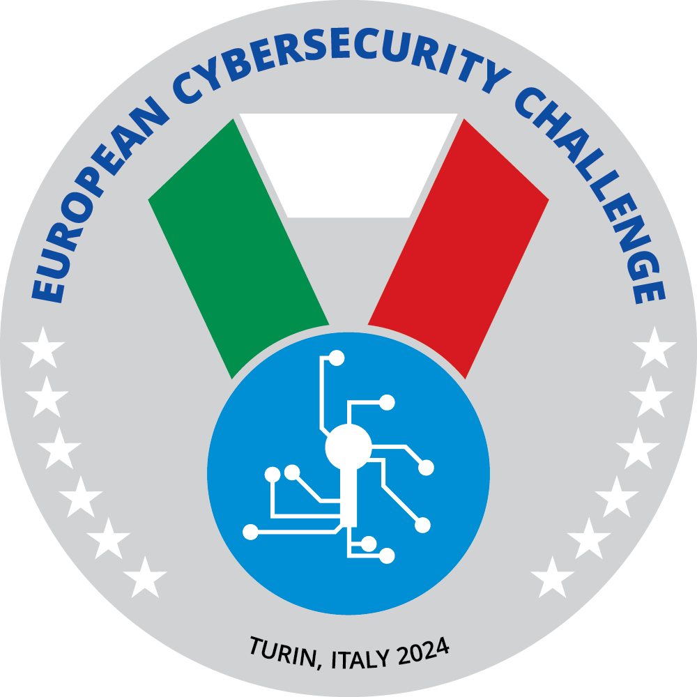

# ECSC 2024 - Attack/defense services

Attack/defense services for [ECSC 2024](https://ecsc2024.it), written
by [CINI - Cybersecurity National Lab](https://cybersecnatlab.it).

  
  

CTF managers: [Giulia Martino](https://github.com/giuliamartino) & [Matteo Rossi](https://github.com/mr-96)

Platform and system administrators: [Gianluca Altomani](https://github.com/devgianlu) & [Giovanni Minotti](https://github.com/Giotino)

## Services

|  #  | Service                               | Flagtores | Vulns | Ports      | Categories   | Authors                                                     |
|:---:|:------------------------------------- |:---------:|:-----:|:---------- |:------------ |:----------------------------------------------------------- |
|  1  | [APT Finals](/sources/APT-Finals)     |     2     |   3   | 8080       | misc, crypto | Gianluca Altomani <@devgianlu>, Lorenzo Demeio <@Devrar>    |
|  2  | [CookingNonna](/sources/CookingNonna) |     1     |   2   | 2222       | pwn, crypto  | Giulia Martino <@Giulia>, Matteo Rossi <@mr96>              |
|  3  | [Diese](/sources/Diese)               |     2     |   4   | 80         | pwn, web     | Andrea Biondo <@abiondo>, Riccardo Bonafede <@bonaff>       |
|  4  | [duogesto](/sources/duogesto)         |     1     |   3   | 4960       | web, misc    | Stefano Alberto <@Xato>, Matteo Protopapa <@matpro>         |
|  5  | [fonograph](/sources/fonograph)       |     1     |   2   | 5000       | crypto, web  | Francesco Felet <@PhiQuadro>, Aleandro Prudenzano <@drw0if> |
|  6  | [Sanromolo](/sources/Sanromolo)       |     1     |   2   | 1337, 1338 | misc, pwn    | Alberto Carboneri <@Alberto247>, Marco Bonelli <@mebeim>    |

## Checkers & exploits

See [checkers/](/checkers) and [exploits/](/exploits)

## Competition data

- Team info: [team.csv](/data/teams.csv)
- Service info: [services.csv](/data/services.csv)
- Flags generated: [flags.csv](/data/flags.csv)
- Flag IDs: [flagid.csv](/data/flagid.csv)
- Stolen flags: [stolen_flags.csv](/data/stolen_flags.csv)
- Team service: [team_services.csv](/data/team_services.csv)
- SLA Checks: [scoreboard_checks.csv](/data/scoreboard_checks.csv)
- APIs: [/data/api/](/data/api/)

...and more data on [/data/](/data/)

## Final scoreboard

[Online scoreboard](https://ad.ecsc2024.it/scoreboard)

## Stats

[Online Stats](https://ad.ecsc2024.it/stats)

## Network diagram

